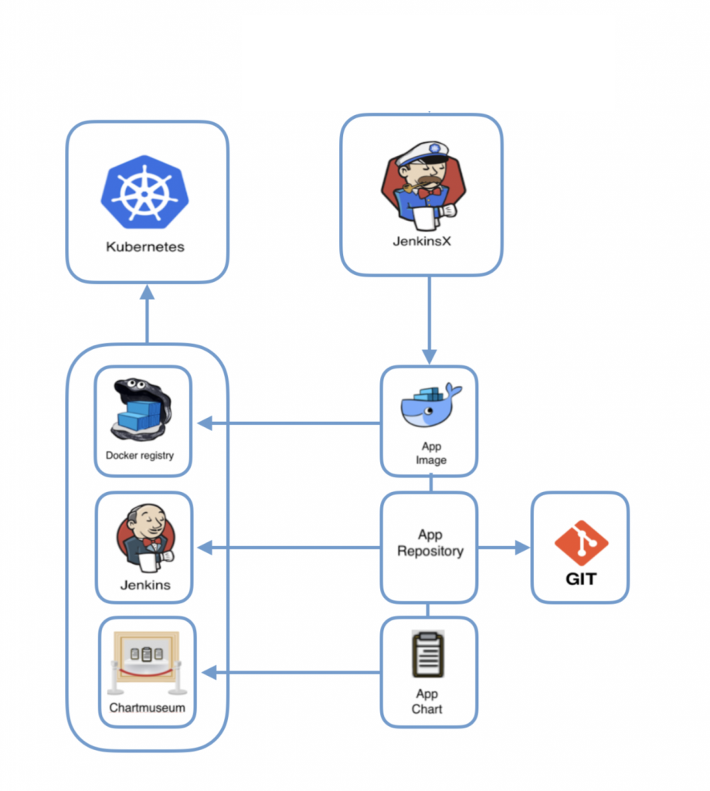
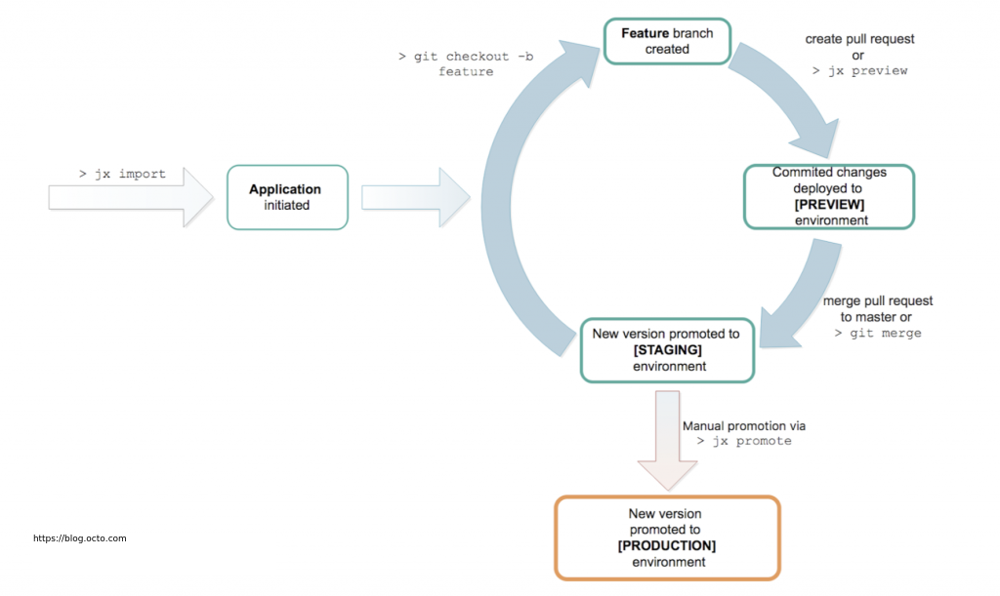

# DevOps Challenge

**Status:** under development

Todo:

- [x] VPC
- [x] EKS Module
- [x] EBS Storage
- [x] EKS Dashboard / EKS Heapster
- [x] ECR - Container Registry
- [x] Jenkins-x Module
- [x] Jenkins-x Apps Module
- [x] Helm Charts    API / WEB
- [x] Skaffold config API / WEB
- [x] RDS
- [x] Terraform Remote State S3 and Locking DynamoDB


##### Run Vagrant devops-box
```bash
$ git clone https://github.com/petersonwsantos/devops-challenge-apps.git
$ cd devops-challenge-apps
$ git checkout gitops
```

##### Run Vagrant devops-box

```bash
$ vagrant up && vagrant ssh
```

##### Configure AWS cli

```bash
#configure awscli
$ aws configure

```

##### Configure Terraform variables

```bash

$ cd /vagrant

$ cp terraform.tfvars.example terraform.tfvars

# configure variables
$ vi terraform.tfvars

```

##### Terraform - Create Infrastructure




```bash
# Create bucket S3
$ aws s3api create-bucket \
  --bucket $(cat terraform.tfvars | grep ^'bucket_backend ' | awk '{print $3}' | sed 's/\"//g') \
  --region $(cat terraform.tfvars | grep ^'region '         | awk '{print $3}' | sed 's/\"//g')

$ aws s3api put-bucket-versioning \
  --bucket $(cat terraform.tfvars | grep ^'bucket_backend ' | awk '{print $3}' | sed 's/\"//g')  \
  --versioning-configuration "Status=Enabled"

# Download modules and initialize S3 backend
$ terraform init \
    -backend-config="region=$(cat terraform.tfvars | grep ^'region '        | awk '{print $3}' | sed 's/\"//g')" \
    -backend-config="bucket=$(cat terraform.tfvars | grep ^'bucket_backend '| awk '{print $3}' | sed 's/\"//g')"  \
    -backend-config="key=$(cat terraform.tfvars    | grep ^'key_backend '   | awk '{print $3}' | sed 's/\"//g')"

# Create infrastructure
$ terraform plan -out=apply.me && terraform apply apply.me
```

##### Create Environments

```bash
# Configure token
$ bash -c "$(terraform output -module=jx token)"

# Open  http://your_jenkins_url/configure and
# configure the field "Jenkins URL" with "http://your_jenkins_url"

# create environments
$ bash -c "$(terraform output -module=jx env_staging)"
$ bash -c "$(terraform output -module=jx env_production)"
```

##### Import Applications

```bash

# Import applications
$ bash -c "$(terraform output -module=jx_app_api import_app)"
$ bash -c "$(terraform output -module=jx_app_web import_app)"
```


##### Jenkins-x Flow





##### Demo - Creating a new feature

```bash


# STEP 1 - DEVELOPER XXXXXXXXXXXXXXXXXXXXXXXXXX

# Clone app repo
$ cd web

# Create an issue
$ jx create issue -t 'feature version'

# Create new branch for PR
$ git checkout -b feature_version

# Code a feature
$ vi routes/index.js

# Push file and connect commit with issue #1
$ git add routes/index.js
$ git commit -m 'add feature ver -  fixes #1'
$ git push origin feature_version

# Create PR with hub or manually in Github page
$ hub pull-request

# STEP 2 - PRODUCT OWNER (or similar) XXXXXXXXXXXXXXXXXXXXXXXXXX

Automatically is created a pipeline for this PR and preview environment.

Approve Pull Request ?

-> If Yes - new release will be automatically created.

-> If no  - finish process.

# STEP 3 - DEPLOY RELEASE XXXXXXXXXXXXXXXXXXXXXXXXXX

# Promote release in Production environment
$ jx promote --app='web' --version='0.0.10' --env='production' --batch-mode=true

# Rollback version
$ jx promote --app='web' --version='0.0.9' --env='production' --batch-mode=true
```

##### Delete

```bash
# Step 1 - Delete Jenkins-X and ELBs(*)
# This command must be executed first, because the ELBs
#  created by Kubernetes (services / ingress) make it
#  impossible for Terraform to destroy the VPC.
$ terraform destroy -target=null_resource.jx_installation --force

# Step 2
$ terraform destroy --force
```


.

.

Sources of study and credits:

* https://www.terraform.io/
* https://www.restcomm.com
* https://jenkins-x.io/
* pictures taken from the blog https://blog.octo.com (thanks  Ilya Trofimov and Nick Shulhin)


